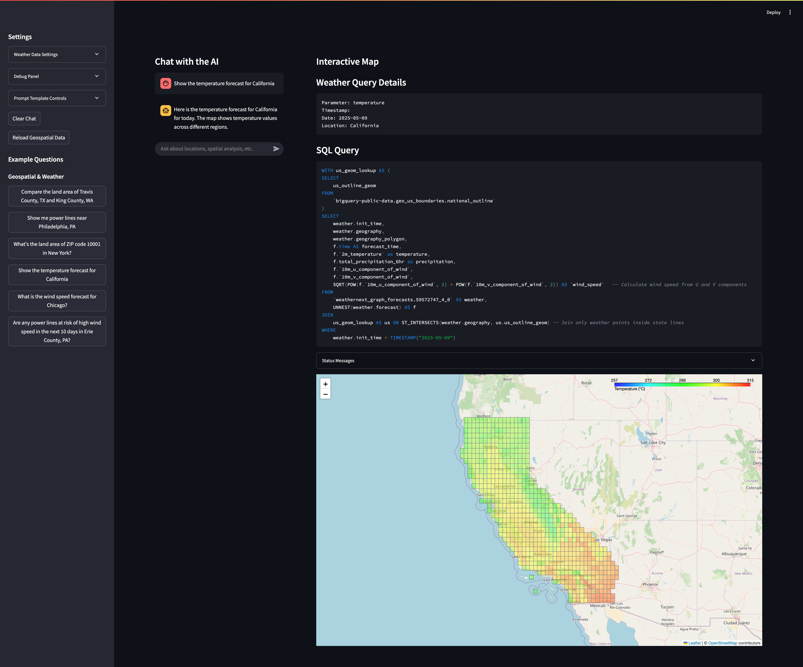

# Gemini Geospatial Streamlit

A powerful interactive application that combines Google's Gemini AI with geospatial analysis capabilities, enabling natural language-driven exploration and visualization of geographic data.



## 🌟 Features

- **AI-Powered Chat Interface**: Interact with geospatial data using natural language queries
- **Interactive Map Visualization**: Real-time display of geospatial data with multiple layer support
- **Risk Analysis Tools**: Specialized tools for assessing weather risks to infrastructure
- **Power Line Infrastructure Analysis**: Visualize and analyze power line networks
- **Integrated Weather Data**: Access weather forecasts and analyze weather-related risks

## 📋 Requirements

- Python 3.10+
- Google Gemini API key
- Streamlit
- GeoPandas and other geospatial libraries (see `requirements.txt` for full details)

## 🚀 Quick Start

1. **Clone the repository**
   ```bash
   git clone https://github.com/yourusername/gemini-geospatial-streamlit.git
   cd gemini-geospatial-streamlit
   ```

2. **Create a virtual environment and install dependencies**
   ```bash
   python -m venv venv
   source venv/bin/activate  # On Windows: venv\Scripts\activate
   pip install -r requirements.txt
   ```

3. **Set up environment variables**
   
   Create a `.env` file in the project root with the following variables:
   ```
   PROJECT_ID=your_google_cloud_project_id
   GCS_BUCKET_NAME=your_gcs_bucket_name
   ```

4. **Download supplementary shapefiles**
   ```bash
   python download_gcs_data.py
   ```
   This will download required shapefiles and other geospatial data from the specified GCS bucket to the `data/local` directory.

5. **Run the application**
   ```bash
   streamlit run app.py
   ```

6. **Access the web interface**
   
   Open your browser and navigate to http://localhost:8501

## 🧩 Architecture

The application is structured into several key components:

- `app.py`: Main entry point for the Streamlit application
- `components/`: UI components including chat interface, map, and sidebar
- `services/`: Core services for Gemini integration, map processing, and risk analysis
- `data/`: Data access and processing modules
- `utils/`: Utility functions and helpers
- `action_handlers/`: Handlers for map actions triggered by AI responses

## 🔍 Usage Examples

### Ask About Regional Weather Risks

```
"What areas in Pennsylvania are at high risk for wind damage to power lines in the next 3 days?"
```

### Analyze Specific Regions

```
"Show me the power infrastructure in Chester County and highlight areas with potential weather impacts."
```

### Compare Multiple Regions

```
"Compare the weather risks between Philadelphia and Pittsburgh for the next week."
```

## 🧠 How It Works

1. User submits a query through the chat interface
2. The query is processed by the Gemini AI model with a specialized system prompt
3. Gemini generates a structured response including:
   - Text response for the user
   - Map action instructions
   - Optional structured data for visualization
4. The application processes the map actions to update the interactive map
5. Results are displayed to the user in both chat and map interfaces

## 🛠️ Configuration

You can configure the application behavior in the sidebar, including:

- Model parameters
- Feature toggles for specific capabilities
- Date selection for weather forecasts
- Debug panel for viewing system prompts and API responses

## Cloud Deployment

### 1. Enable Required APIs
```bash
# enable services
gcloud services enable storage.googleapis.com &&
gcloud services enable run.googleapis.com &&
gcloud services enable aiplatform.googleapis.com &&
gcloud services enable cloudbuild.googleapis.com

# grant permissions to service account
export PROJECT_ID=`gcloud config get-value project`
export PROJECT_NUMBER=`gcloud projects describe $PROJECT_ID --format="value(projectNumber)"`
gcloud projects add-iam-policy-binding $PROJECT_ID --member=serviceAccount:$PROJECT_NUMBER-compute@developer.gserviceaccount.com --role="roles/run.builder"
#gcloud projects add-iam-policy-binding $PROJECT_ID --member=serviceAccount:$PROJECT_NUMBER-compute@developer.gserviceaccount.com --role="roles/logging.logWriter"
#gcloud projects add-iam-policy-binding $PROJECT_ID --member=serviceAccount:$PROJECT_NUMBER-compute@developer.gserviceaccount.com --role="roles/storage.objectUser"
```

### 2. Deploy to Cloud Run

**Manually enable IAP then run:**
> gcloud beta run deploy wp-extract-demo --source . --region="us-central1" --no-allow-unauthenticated --iap

-- Deploying from Artifact Registry ...: Y
-- Allow unauthenticated invocations...: N

### 3. Enable IAP
2. Add IAP-secured Web App User to appropriate users


### 4: Configure Environment and Secrets
1. Go to Cloud Run service → Source → Edit source
2. Rename `.env.example` to `.env` and update with your configuration, for example:
```bash
GCP_PROJECT_ID=your-project-id
GCS_BUCKET_NAME=your-bucket
GCS_PREFIX=examples/
GCP_REGION=global
DEFAULT_MODEL=gemini-2.5-pro
FLASH_MODEL=gemini-2.5-flash
```
3. Rename `secrets.toml.example` to `secrets.toml`
4. Update with your Google Auth Platform credentials, for example:
```toml
[auth]
redirect_uri = "https://your-app-url/oauth2callback"
cookie_secret = "your-random-cookie-secret"
client_id = "your-google-client-id"
client_secret = "your-google-client-secret"
server_metadata_url = "https://accounts.google.com/.well-known/openid-configuration"
```

## 📊 Data Sources

The application uses several data sources:

- Weather forecast data
- US geographic boundaries (states, counties)
- Power infrastructure data for Pennsylvania
- Custom local datasets (as configured)
- Supplementary shapefiles stored in a GCS bucket specified by the `GCS_BUCKET_NAME` environment variable

## 🤝 Contributing

Contributions are welcome! Please feel free to submit a Pull Request.

1. Fork the repository
2. Create your feature branch (`git checkout -b feature/amazing-feature`)
3. Commit your changes (`git commit -m 'Add some amazing feature'`)
4. Push to the branch (`git push origin feature/amazing-feature`)
5. Open a Pull Request

## 📄 License

This project is licensed under the MIT License - see the [LICENSE](LICENSE) file for details.
